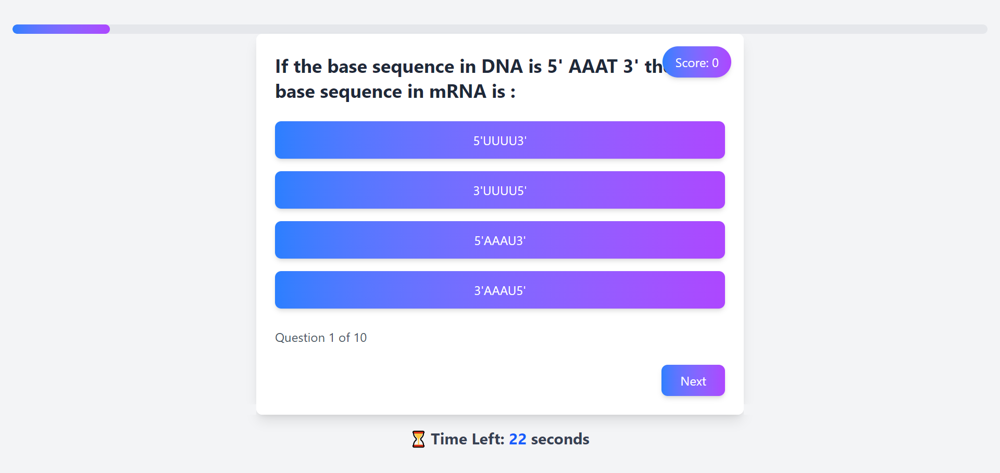

# Quiz App

A gamified quiz app built with **React**, **Tailwind CSS**, and **Vite**. The app fetches quiz data from an API, displays questions with multiple-choice answers, and provides a detailed summary of results upon completion.

## Features

- **Gamified Design**: Modern UI with gradient backgrounds, animations, and shadows.
- **Responsive**: Mobile-first design that works on all screen sizes.
- **Score Tracking**: Real-time score updates with correct and incorrect answers.
- **Detailed Results**: View correct answers, incorrect answers, and unanswered questions with detailed solutions.
- **Timer**: Countdown timer for each question.

## Screenshots and Demo

Check out the `demo` folder for screenshots and a video walkthrough of the app.

[](demo/quiz-app-demo.mp4)




## Setup Instructions

1. Clone the repository:
   ```bash
   git clone https://github.com/SURAJ-K-GUPTA/quiz-app.git
   cd quiz-app
   ```

2. Install dependencies:
   ```bash
   npm install
   ```

3. Start the development server:
   ```bash
   npm run dev
   ```

4. Open your browser and navigate to http://localhost:5173.

## Technologies Used

- **React**: JavaScript library for building the user interface.
- **Tailwind CSS**: Utility-first CSS framework for styling.
- **Vite**: Fast build tool for modern web development.
- **Axios**: For fetching quiz data from the API.

## Folder Structure
```
quiz-app/
├── public/
├── src/
│   ├── components/
│   │   ├── ProgressBar.jsx
│   │   ├── QuizCard.jsx
│   │   ├── ResultCard.jsx
│   │   └── Timer.jsx
│   ├── pages/
│   │   ├── Home.jsx
│   │   └── Quiz.jsx
│   ├── utils/
│   │   └── api.js
│   ├── App.jsx
│   ├── main.jsx
│   ├── index.css
├── package.json
├── tailwind.config.js
```
